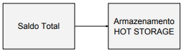

### Resumo da Entrega
Inicialmente, foi realizado um levantamento com o objetivo de obter ferramentas para proteção de senhas reportadas na literatura, sem intenção de esgotar o assunto. Diante da organização de tarefas associadas a esta User Story, e para que estivessem coerentes, foi realizado um alinhamento com a equipe do escopo do projeto e como este trata as diversas carteiras do sistema e dos clientes. Sendo assim, através de uma busca inicial com foco em tutoriais, blogs, revistas de mercado e repositórios de código, fomos capazes de identificar técnicas e soluções existentes de segurança para chaves privadas. 

Através das vantagens e desvantagens das técnicas e soluções de segurança já existentes foi possível conduzir a análise conforme solicitado pelo critério de aceitação. Além dos exemplos mencionados de técnicas de cold storage e multi-assinatura, foi possível elencar as seguintes soluções:

- Multi-assinatura: Foi usado para dar um enfoque total na segurança da transação ;
- Web Wallet;
- Mobile Wallet;
- Paper Wallet;
- Vault;
- Técnica de autenticação via QR Code.
  
O documento detalhado com a análise realizada e os prós e contras de cada abordagem pode ser obtido nos Anexos. 

Em seguida, foi conduzida a análise de pesquisas sobre ataques a Exchanges e sobre a Proteção de dados feitas pelas Exchanges. Diante dos desafios em identificar onde as chaves privadas ficam armazenadas, visto que elas não precisam ficar online o tempo todo, percebemos que seria possível obter o plano político dos dados adotado pelas Exchanges, ou seja, "o que" as Exchanges fazem. No entanto, o plano estratégico, ou seja, "como elas fazem" e em qual "sequência" elas fazem, caracteriza uma vantagem competitiva que as colocaria em risco caso descrevessem. Assim, para cumprir com o critério de aceitação, relacionamos o que as Exchanges oferecem e fizemos algumas suposições do processo adotado.

Partimos para a análise dos ataques sumarizados em um documento que pode ser encontrado nos Anexos. Além disso, uma pesquisa bibliográfica que resultou em papers interessantes[1], [2], [3]  além de links a blogs e sites oficiais de algumas exchanges. Diante do Documento de ataques, foi possível perceber "o que" cada exchange vítima de ataque fazia e estabelecer um possível processo diante de "como foi vítima", logo o processo supostamente adotado possui falhas. Estas falhas se manifestaram em 3 nichos de atuação das exchanges vítimas: (i) no cadastro e autenticação, (ii) nas transações, e (iii) no back-end (funcionários e processos internos com os quais os usuários não se relacionam). Tais nichos indicam pontos onde o ataque poderia ser interceptado ou ter seus efeitos minimizados. Outro ponto em comum observado nas exchanges vítimas foi a falta da guarda compartilhada, com os usuários, das chaves privadas. Diante dessa análise, iniciamos um modelo de processo que ofereça um "plus" de segurança que fuja ao ordinário e tenta driblar os erros das vítimas de ataques.

Com relação ao Cold Storage, várias soluções como: gavetas do servidor que são retiradas e protegidas offline, os pen drives, ou ainda impressões em papel que o cliente pode carregar, são exemplos de cold storage. Assim, Cold Storage é uma denominação que pode ser atribuída a vários tipos de solução. Em relação à CoinBase, existe diferença da robustez de segurança oferecida para diferentes tipos de usuários da CoinBase. O que fomos capazes de supor quanto ao processo adotado é o seguinte: a CoinBase refaz a criptografia das chaves a cada ação, armazena os dados dos usuários em localizações geográficas distintas e armazena os dados dos usuários de forma offline. Conforme o investimento do usuário no serviço é oferecida a opção de armazenar os dados em um Vault e suas transações levam até 48 horas para serem feitas. Também há a opção de multi assinaturas. Em caso de suspeita a CoinBase pode bloquear os fundos do usuário para garantir mais segurança. 

Foi realizada uma análise das práticas adotadas na solução open source de Vault oferecida pela Hashicorp, citada pelo blog da exchange CoinBase. Trata-se de uma ferramenta para acessar segredos de forma segura. Um segredo pode ser "qualquer coisa" que se queira ter controle sobre o acesso: certificados, senhas, chaves. A ferramenta é apoiada por logs e políticas de controle de acesso. Tem como princípios ser orientada a API, permitindo automatização e políticas de integração contínua e entrega contínua. Além de larga possibilidade de integração por oferecer suporte a serviços de Cloud públicas, Data Centers privados e uma ampla variedade de sistemas de terminais, incluindo bancos de dados, plataformas de nuvem, filas de mensagens, SSH, entre outros (AWS, Azure, Oracle).

A arquitetura oferecida pelo Vault da Hashicorp é fundamentada em 3 pilares: (i) um cliente, (ii) um servidor e (iii) um back-end. Neste contexto, o back-end compreende a forma de armazenar os dados e segredos dos clientes. É possível variar o storage de acordo com os recursos disponíveis ou que se tenha interesse, por exemplo, pode ser disco físico como pen drives, banco de dados SQL, serviços de Cloud, ou ainda in-memory mas que representa baixa segurança. Oferece três abordagens básicas para autenticar, com segurança, um consumidor de segredos: (i) Integração por Plataforma: neste modo, o Vault confia na plataforma subjacente (por exemplo, AliCloud, AWS, Azure, GCP) que atribui um token ou identidade criptográfica (como token do IAM, JWT assinado) à máquina virtual, ao contêiner ou à função serverless. (ii) Orquestrador confiável: nesse modo, há um orquestrador que já está autenticado no Vault com permissões privilegiadas. O orquestrador lança novos aplicativos e injeta um mecanismo que eles podem usar para autenticação (por exemplo, AppRole, certificado PKI, token etc.) com o Vault. E (iii) Agente Vault: este é um daemon de cliente que automatiza o fluxo de trabalho de login do cliente e atualização de token. Ele pode ser usado em conjunto com as abordagens de integração por plataforma ou de orquestrador confiável.

Diante do Terceiro nicho que concentra os ataques a exchanges, associado aos funcionários e processos internos, fica evidente de forma geral a necessidade de se criar e manter uma cultura de segurança. O projeto Vault oferece Orientações sobre as práticas recomendadas para uma implantação reforçada em produção do Vault. As recomendações baseiam-se no modelo de segurança adotado por essa implementação de Vault e concentram-se na defesa em profundidade. Algumas das recomendações que não estão associadas a aspectos puramente técnicos, pode-se citar:
TLS de ponta a ponta . O Vault sempre deve ser usado com o TLS em produção. Se balanceadores de carga intermediários ou proxies reversos forem usados ​​para o Vault, eles não deverão finalizar o TLS. Desta forma, o tráfego é sempre criptografado em trânsito para o Vault e minimiza os riscos introduzidos pelas camadas intermediárias.

Tráfego de firewall . O Vault escuta em portas bem conhecidas, usa um firewall local para restringir todo o tráfego de entrada e saída para o Vault e serviços essenciais do sistema, como o NTP. Isso inclui restringir o tráfego de entrada para sub-redes permitidas e tráfego de saída para os serviços que o Vault precisa se conectar, como bancos de dados.

Desativar o SSH / Área de Trabalho Remota. Ao executar um Vault como um aplicativo dedicado, os usuários nunca devem acessar a máquina diretamente. Em vez disso, eles devem acessar o Vault por meio de sua API pela rede. Use uma solução centralizada de registro e telemetria para depuração. Certifique-se de restringir o acesso aos registros conforme necessário.

Desativar o Swap. O Vault criptografa dados em trânsito e em repouso, no entanto, ele ainda deve ter dados confidenciais na memória para funcionar. O risco de exposição deve ser minimizado desativando-se o swap para evitar que o sistema operacional aloque dados confidenciais para o disco. O Vault tenta "bloquear a memória" na memória física automaticamente, mas a desativação do swap adiciona outra camada de defesa.

Restringir o acesso ao armazenamento. O Vault criptografa todos os dados em repouso, independentemente de qual back-end de armazenamento é usado. Embora os dados sejam criptografados, um invasor com controle arbitrário pode causar adulteração ou perda de dados, modificando ou excluindo chaves. O acesso ao back-end de armazenamento deve ser restrito apenas ao server do Vault para evitar acesso ou operações não autorizados.

Atualizações imutáveis . O Vault depende de um back-end de armazenamento externo para persistência, e esse desacoplamento permite que os servidores que executam o Vault sejam gerenciados de forma imutável. Ao atualizar para novas versões, novos servidores com a versão atualizada do Vault são colocados on-line. Eles estão conectados ao mesmo back-end de armazenamento compartilhado e não lacrados. Então os servidores antigos são destruídos. Isso reduz a necessidade de acesso remoto e orquestração de atualização, o que pode introduzir falhas de segurança.

Ativar os Logs e auditorias. O Vault suporta vários back-ends de auditoria. A ativação da auditoria fornece um histórico de todas as operações realizadas pelo Vault e fornece uma pista forense no caso de uso indevido ou comprometimento. Registros de auditoria protegem com segurança quaisquer dados confidenciais, mas o acesso ainda deve ser restrito para evitar divulgações não intencionais.

Sobre esse assunto, foi realizada uma análise das lições aprendidas pela CoinBase e que foram relatadas em seu blog, no processo de amadurecimento desde sua criação. Dentre as lições, algumas complementam as recomendações e citam-se: 
- Redundância e consenso entre várias partes.
- Logs robustos, acessíveis em várias redes e distribuídos.
- Detecção de anomalias: a procura por irregularidades nos logs em três níveis de alertas (avisos, erros e questões críticas).
- Implantação com base em consenso: um processo de 3 fases em que qualquer um deve ser capaz de propor qualquer mudança, mas o consenso deve ser alcançado antes que a proposta possa ser aplicada.

Embora traga informações relevantes, alguns leitores do blog da CoinBase suscitaram críticas e questionamentos. A crítica de que estaria faltando abordar sistemas de detecção de invasões baseados em host e rede, honeypots e outros métodos para detectar atividades não autorizadas. Isso se justifica pois, um bom profissional de segurança deve assumir que redes e sistemas de back-end já estão comprometidos e construir uma estratégia de detecção em torno dele. Outro leitor sugeriu a utilização de bitcoin vault [5], [6] para a proteção. O questionamento indaga sobre a proteção do banco de dados KYC, uma vez que as fotos KYC, e IDs, são oferecidos não são apresentadas garantias de que este banco de dados não será comprometido.
Outras referências também foram estudadas ao longo do desenvolvimento dessa US e valem ser citadas. A análise do OkHttp & OAuth [7] para a atualização de tokens, é uma alternativa de solução ao processo de autenticação de usuário. O blog da Kaspersky apresenta uma visão geral de hardware wallets e dois estudos de casos [8] de pesquisadores que identificaram falhas e conseguiram acesso aos dados assegurados pelos dispositivos.

### Resultados Obtidos
Com base nas técnicas existentes para a segurança das chaves privadas foi possível elaborar um novo modelo de segurança, onde seu foco é proporcionar ao usuário mais segurança desde seu cadastro/login até as suas transações, abrangendo os nichos que as falhas se concentraram, nos casos de ataque analisados. Os diagramas dos processos de cadastro e login são mostrados e explicados mais adiante.

Para o cadastro e login do usuário os envolvidos da US desenvolveram um a ideia de mecanismo que faz a verificação das informações do usuário tanto no ato do cadastro quanto no ato do seu login.

Figura 1- Cadastro do usuário.

Já para o login do usuário tem se o seguinte processo de autenticação.

Figura 2- Login do usuário via Web/Desktop.

Figura 3- Login do usuário via QR Code.

Depois da parte de login e cadastro já apresentados, o próximo passo foi elaborar uma solução de segurança em relação ao processo de transação monetária da criptomoeda. Então teve-se como base os estudos das técnicas que são aplicados as carteiras existentes atualmente.

Depois destes estudos foram levantadas várias hipóteses da criação de um novo modelo de segurança de transações monetárias que surgisse por meio das combinações das técnicas já consolidadas e aprovadas no meio da criptomoeda, que são consideradas como processos confiáveis e eficazes.

Depois de um tempo refletindo e discutindo sobre isso, os envolvidos da US decidiram dividir os níveis de segurança em três, que ia de um tipo de usuário que fazia um investimento considerado baixo, o outro tipo seno considerado como médio e o último sendo considerado um investimento alto. Dentro dessa divisão de investimento foi elaborado três tipos de diagramas para melhor atender cada divisão de usuários. Lembrando que o mecanismo de cadastro e login é igual para todos os tipo de de divisão.

Esses três tipos de usuários foram nomeados de Silver, Gold e Platinum.

#### Silver:
O tipo de usuário silver foi planejado para fazer transações com um nível de segurança que o protegesse o mesmo de alguma invasão. Caso haja algum tipo de movimentação monetária suspeita, ou acima do valor historicamente registrado o algoritmo foi planejado para interromper a transação até que haja a confirmação do usuário por meio de uma mensagem ou ligação direcionada para o mesmo, com um código de confirmação. Caso o código esteja correto então, a transação seguirá o fluxo de continuidade normal, Caso o código esteja errado, a transação é cancelada, o usuário será informado do ocorrido e receberá um comunicado que criptografia da sua chave privada foi trocada automaticamente e o mesmo terá que trocar a sua senha o quanto antes para evitar novas atividades suspeitas.

Outro ponto que foi pensando foi a validade da chave privada, onde se houver uma renovação da mesma, ou seja, a geração de chaves periódicamente que pode ser determinado pelo cliente, onde a ideia disso é dificultar que os hackers possam descobrir o endereço das chaves do usuário.

Figura 4- Diagrama do processo de transação monetária Silver.
Já para a parte de armazenamento nesse tipo de divisão, é feito em HOT STORAGE, ou seja, os dados desse usuário ficam salvos apenas nos servidores contratados pela Empresa, onde esses servidores ficam geograficamente espalhados ao redor do mundo visando maior segurança do cliente e um QR Code é entregue ao mesmo para facilitar a sua transferência  monetária sem que o usuário precise memorizar as suas chaves.

Figura 5- Diagrama do Armazenamento Silver

#### Gold:
Para a divisão gold o processo de transação é bem parecido com o citado anteriormente (o Silver), a diferença aqui é que o algoritmo de segurança para o gold é a aplicação da técnica de multi-assinatura que traz mais segurança ao usuário, tendo em vista que sua classificação já é a de um investidor moderado, ou seja irá investir uma quantia considerável em suas transações.

Figura 6- Diagrama do processo de transação monetária Gold e Platinum.

Para esse tipo de usuário é feito uma mesclagem na forma de armazenar o seu dinheiro investido, onde uma pequena quantia (uma quantia diária) é armazenado em  HOT STORAGE, ou seja, os dados desse usuário ficam salvos nos servidores contratados pela Empresa, onde esses servidores ficam geograficamente espalhados ao redor do mundo visando maior segurança do cliente, um QR Code é entregue ao mesmo para facilitar a sua transferência monetária sem que o usuário precise memorizar as suas chaves e o seu montante  total de dinheiro é salvo em carteiras do tipo COLD STORAGE. Esse tipo de armazenamento é feito de maneira totalmente Offline para que o dinheiro do usuário fique fora de risco de roubos, ataques hackers e outros tipos de vírus maliciosos.

Neste tipo de usuário usa-se também a combinação de algumas chaves trazendo mais segurança para o mesmo e tornando sua conta mais difícil de ser hackeada pelo fato de estar sendo utilizada de uma forma onde precisa ter algumas chaves para liberar todas as ações da conta deste usuário.

Figura 7- Diagrama do Armazenamento Gold

#### Platinum:
A última  divisão, a Platinum possui o mesmo processo de segurança o que a divisão Gold, pois ambas foram pensadas para ter a técnica de multi-assinatura que até o momento é a forma de autenticação mais segura que existe para uma transação.

A principal diferença é que para esse tipo de usuário o armazenamento também é bem parecido com o Gold, mas no Platinum há uma forma extra de armazenar a carteira do usuário que é por meio do Vault que serve como um Backup de segurança da mesma.

Figura 8- Diagrama do Armazenamento Platinum

Após a transação ter sido realizada com sucesso, elaboramos um processo de armazenamento que propicia ao cliente agendar um melhor horário para proceder o armazenamento já que este consome tempo e não pode ser feito durante a transação, por exemplo, no uso do Vault é solicitado 48 horas para a operação.

Figura 9- Diagrama de agendamento de Armazenamento
### Sugestão de trabalhos futuros
- Recomenda-se a geração de um PoC a partir dos Diagramas entregues.
- Como trabalhos futuros, sugere-se um estudo sobre detecção de anomalias a partir de técnicas de Inteligência Artificial. Além disso, a automatização de processos de autenticação e reconhecimento de chaves, utilizando técnicas de I.A.
- Outra sugestão é um estudo sobre KYC, sob o ponto de vista da proteção a dados sensíveis, e sob o ponto de vista do atendimento a lei de acesso a dados internacional e nacional.

### Anexos
Técnicas e soluções de segurança: 
https://drive.google.com/open?id=1NvnfqrH4X04YSu6AVpeg0Z1fh_5Ui4ZSvB3dkEija8w 

Ataques a Exchanges: https://gitlab.com/projetostamps/stamps/blob/dev/US09/Ataques.md 

Proposta de Modelo de Segurança:
Diagrama Silver Client:
https://drive.google.com/open?id=15br-V-QtBq9rvfEkX0u-rt0n69IUYmWj

Diagrama Gold Client:
https://drive.google.com/open?id=1m1KtYe9Mz1ErS2Zhk7S0poEYvtv59WX5

Diagrama Platinum Client:
https://drive.google.com/open?id=1ZkGlNtcFB5Wu9C-j0xXJL2nwdewWEvqL

Diagrama QR Code:
https://drive.google.com/open?id=1RzNQlkvtDUglYVPTvHRQxtKSstzbbWGk

Diagrama Draft Storage:
https://drive.google.com/open?id=1L-r6Lj7fgWcekgwpWGfmX69seZh7yzdb 

Apresentação:
https://docs.google.com/presentation/d/1vmJAMFHxs7PZYJNMZ2uUPH4qzEpz_x-ySSvTr-F42y4/edit#slide=id.p1 

### Referências

[1] Kim, Chang Yeon, and Kyungho Lee. "Risk management to cryptocurrency exchange and investors guidelines to prevent potential threats." 2018 International Conference on Platform Technology and Service (PlatCon). IEEE, 2018.

[2] Wang, Rong, et al. "A Distributed Digital Asset-Trading Platform Based on Permissioned Blockchains." International Conference on Smart Blockchain. Springer, Cham, 2018.

[3] Khedekar, Lokesh S. "Security: An effective technique to protecting sensitive information using quick response code." Communication and Signal Processing (ICCSP), 2016 International Conference on. IEEE, 2016.

[4] Vault da HashiCorp, https://www.vaultproject.io/, acessado em, 26 janeiro 2019.

[5] Bitcoin Vault, http://hackingdistributed.com/2016/02/29/bitcoin-vaults/ , acessado em 26 de janeiro 2019.

[6] Bitcoin Covenants, paper, http://fc16.ifca.ai/bitcoin/papers/MES16.pdf, acessado em 26 de janeiro 2019.

[7] OkHttp & OAuth: Token Refreshes,   https://blog.coinbase.com/okhttp-oauth-token-refreshes-b598f55dd3b2, acessado em 26 janeiro 2019.

[8] How to hack a hardware cryptocurrency wallet, https://www.kaspersky.com/blog/hardware-wallets-hacked/25315/, acessado 26 de janeiro 2019.


